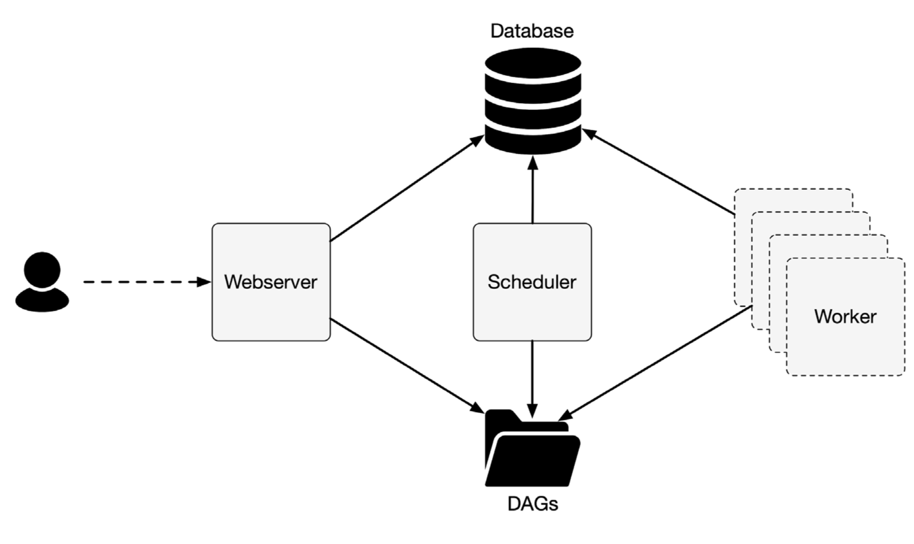
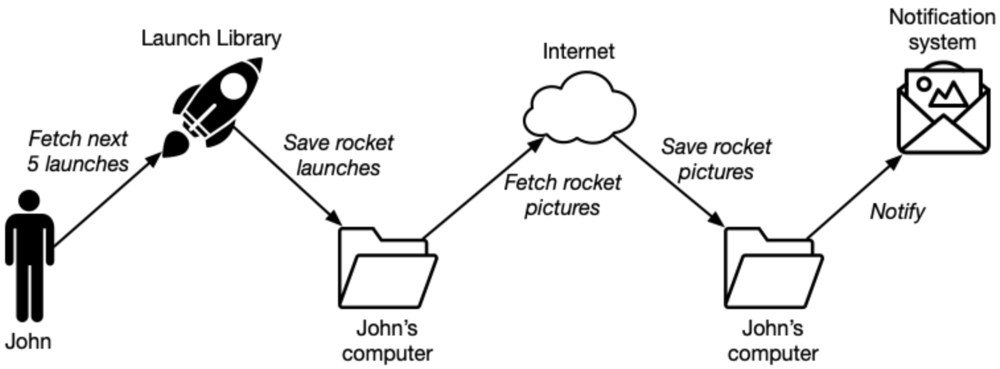
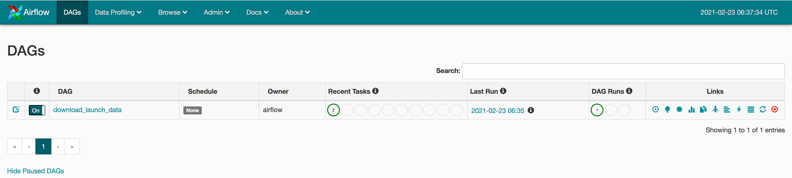
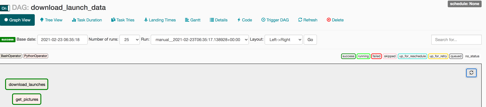
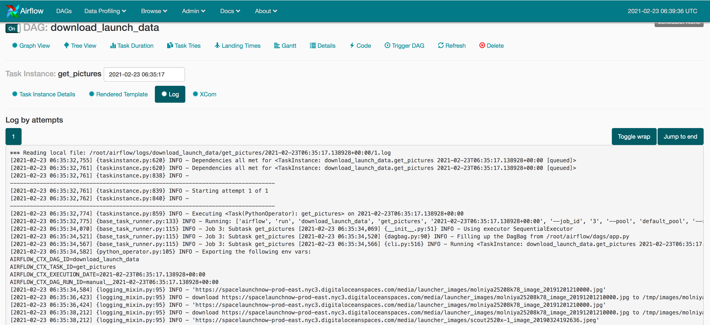
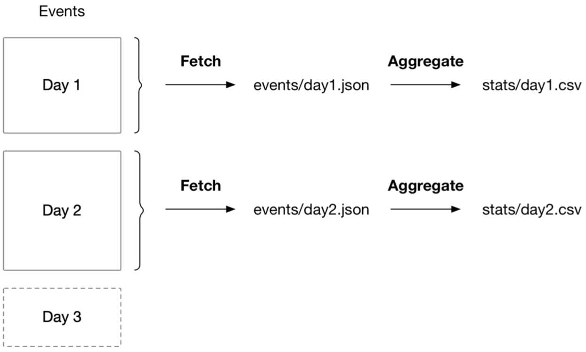

```
    _                     _               _    _       __ _               
   / \   _ __   __ _  ___| |__   ___     / \  (_)_ __ / _| | _____      __
  / _ \ | '_ \ / _` |/ __| '_ \ / _ \   / _ \ | | '__| |_| |/ _ \ \ /\ / /
 / ___ \| |_) | (_| | (__| | | |  __/  / ___ \| | |  |  _| | (_) \ V  V / 
/_/   \_\ .__/ \__,_|\___|_| |_|\___| /_/   \_\_|_|  |_| |_|\___/ \_/\_/  
        |_|                                                               
```

## What is Apache Airflow ?
- A platform for programmatically developing and monitoring batch data pipelines.
- Provides a Python framework to develop data pipelines composed of different technologies.
- Airflow pipelines themselves are also defined in Python scripts.

### Introducing workflow managers
- Many computational processes are composed of multiple actions that are required to be executed in a 
  sequence and at a regular interval.
- The process are expressed as graph of tasks
  - which individual actions make up the process.
  - which order these actions need to be executed.
- These graphs are often called **workflows**.

### Workflow as a series of tasks
- **workflows**, which define a collection of tasks to be run, as well as the dependencies between these tasks (i.e., which tasks need to be run first).
- **Core Concept**: defining tasks as 'units of work' and expressing dependencies between these tasks.
  - This allows workflow management systems to track which tasks should be run when, while also taking care of features such as parallelism, automatic retries of failing jobs, and reporting.

#### Expressing task dependencies

- **task dependencies**: 
  - Relationships between tasks determine when to run a given task. 
  - Which tasks are upstream of the given task (pointing to the task dependencies) or saying which tasks are downstream of the task (marking the task as a dependency of other tasks).

#### Task execution model of workflow management systems
- Workflow management systems is either via a push or pull model.
  - **push model**, a central process pushes work to execute to a worker process.
  - **pull (or poll) model** works by workers continuously polling a central scheduler process checking if there’s new work to pick up.
- In Airflow, there is a central process called the **“scheduler”** which pushes tasks to execute to **workers**.

### An overview of the Airflow architecture



- Airflow consists of:
  - webserver: 
    - provides the visual interface to the user to view and manage the status of workflows.
  - scheduler: 
    - parsing DAG definitions.
    - determining which tasks should be started (scheduled/manually triggered/backfilled).
    - sending tasks to the workers to execute.
  - Worker
  
### Directed Acyclic Graphs
- Cycles would create unsatisfiable dependencies in workflows (we would never know when a pipeline is finished).
- Because of this acyclic property, workflows are modelled as Directed Acyclic Graphs (DAG).
- In Airflow you create and schedule pipelines of tasks by creating a DAG.

### Batch processing
- Airflow operates in the space of batch processes; a series of finite tasks with clearly defined start and end tasks, to run at certain intervals or triggers.
- When used in combination with Airflow, this is always a Spark batch job and not a Spark streaming job because the batch job is finite and a streaming job could run forever.  

### Scheduling and backfilling
- When you want to run a new logic on all previously completed workflows, on all historical data.
- This is possible in Airflow with a mechanism called **backfilling**, running workflows back in time.
- If the fetching of data is not possible back in time, or is a very lengthy process you’d like to avoid, you can rerun partial workflows with backfilling.

### Handling Failures
- Airflow provides various ways for handling failures, varying from for example stating, “It’s okay—continue running other tasks”, to “retry this one failed task for a maximum of 5 times” to “failure here is unacceptable — fail the entire pipeline.”


## Anatomy of an Airflow DAG

### Collecting data from numerous sources

#### Exploring the data
- ```curl -X GET "https://ll.thespacedevs.com/2.0.0/launch/" | jq -rc ```



#### Writing your first Airflow DAG
- We can split a large job, which consists of one or more steps, into individual “tasks” and together form a Directed Acyclic Graph (DAG). Multiple tasks can be run in parallel, and tasks can run different technologies.
- For example, we could first run a Bash script and next run a Python script.
- Fetching the data for the next five rocket launches was a single curl command in Bash, which is easily executed with the BashOperator. However, parsing the JSON result, selecting the image URLs from it and downloading the respective images requires a bit more effort.
- The PythonOperator in Airflow is responsible for running any Python code.

- ```docker run -p 8080:8080 -v $PWD/dags:/root/airflow/dags  airflowbook/airflow```

- 

- 

- 

#### Tasks vs operators

|Tasks|Operators|
|-----|---------|
|Tasks in Airflow manage the execution of an Operator.|they exist to perform one single piece of work.|
|The user can focus on the work to be done by using operators, while Airflow ensures correct execution of the work via tasks.|Some operators perform generic work such as the BashOperator (used to run a Bash script) and the PythonOperator (used to run a Python function). Others have more specific use cases such as the EmailOperator (used to send an email) or the HTTPOperator (used to call an HTTP endpoint).|
|They can be thought of as a small “wrapper” or “manager” around an operator that ensures the operator executes correctly.|Airflow has a class called BaseOperator and many subclasses inheriting from the BaseOperator such as the PythonOperator, EmailOperator, and OracleOperator.|

#### Running at regular intervals
- In Airflow, we can schedule a DAG to run at certain intervals -- once an hour, day or month. This is controlled on the DAG by setting the **schedule_interval** argument:

#### Handling failing tasks
- **Successfully completed tasks**: Only green in the Airflow UI.
- **Specific failed task**: Would be displayed in red in both the graph and tree views.
- **Dependent failed task**: Such task instances are displayed in orange.

- It would be unnecessary to restart the entire workflow. A nice feature of Airflow is that you can restart from the point of failure and onwards, without having to restart any previously succeeded tasks.

## Scheduling in Airflow

- We will dive a bit deeper into the concept of scheduling in Airflow and explore how this allows you to process data incrementally at regular intervals.
  - we’ll introduce a small use case focussed on analyzing user events from our website and explore how we can build a DAG to analyze these events at regular intervals. 
  - Next, we’ll explore ways to make this process more efficient by taking an incremental approach to analyzing our data and how this ties into Airflow’s concept of execution dates.
  - Finally, we’ll finish by showing how we can fill in past gaps in our dataset using backfilling and discussing some important properties of proper Airflow tasks.

```
from datetime import datetime
import pandas as pd
from airflow import DAG
from airflow.operators.bash_operator import BashOperator
from airflow.operators.python_operator import PythonOperator

dag = DAG(
   dag_id="user_events",
   start_date=datetime(2015, 6, 1),
   schedule_interval=None,
)

fetch_events = BashOperator(
    task_id="fetch_events",
    bash_command="curl -o data/events.json https://localhost:5000/events",
    dag=dag, 
)


def _calculate_stats(input_path, output_path):
    """Calculates event statistics."""
    events = pd.read_json(input_path)
    stats = events.groupby(["date", "user"]).size().reset_index()  
    stats.to_csv(output_path, index=False)

calculate_stats = PythonOperator(
   task_id="calculate_stats",
   python_callable=_calculate_stats,
   op_kwargs={
       "input_path": "data/events.json",
       "output_path": "data/stats.csv",
   },
   dag=dag, 
)
```

### Running at regular intervals
- Schedule intervals can be defined using the schedule_interval argument when initializing the DAG.
- By default, the value of this argument is None, which means that the DAG will not be scheduled and will only be run when triggered manually from the UI or the API.

#### Defining scheduling intervals
- Airflow provides the convenient macro “@daily” for defining a daily scheduled interval which runs our DAG once every day at midnight:

- For example, say we define our DAG with a start date on the first of January:
```
import datetime as dt
dag = DAG(
    dag_id="user_events",
    schedule_interval="@daily", 
    start_date=dt.datetime(year=2019, month=1, day=1)
)
```

- Without an end date, Airflow will (in principle) keep executing our DAG on this daily schedule until the end of time. However, if we already know that our project has a fixed duration, we can tell Airflow to stop running our DAG after a certain date using the `end_date` parameter:
```
dag = DAG(
    dag_id="user_events",
    schedule_interval="@daily", 
    start_date=dt.datetime(year=2019, month=1, day=1), 
    end_date=dt.datetime(year=2019, month=1, day=5),
)
```

#### Cron-based intervals
- To support more complicated scheduling intervals, Airflow allows us to define scheduling intervals using the same syntax as used by cron, a time-based job scheduler used by Unix-like computer operating systems such as macOS and Linux.

```
# ┌─────── minute (0 - 59)
# │ ┌────── hour (0 - 23)
# │ │ ┌───── day of the month (1 - 31)
# │ │ │ ┌───── month (1 - 12)
# │ │ │ │ ┌──── day of the week (0 - 6) (Sunday to Saturday; # │ │ │ │ │ 7 is also Sunday on some systems) 
# * * * * *
```

-  For example, we can define hourly, daily and weekly intervals using the following cron expressions:
```
• 0 * * * * = hourly (running on the hour)
• 0 0 * * * = daily (running at midnight)
• 0 0 * * 0 = weekly (running at midnight on Sunday)
```

-  We can also define more complicated expressions such as the following:
```
• 0 0 1 * * = midnight on the first of every month
• 45 23 * * SAT = 23:45 every Saturday
```

- we can build expressions that enable running jobs on multiple weekdays or multiple sets of hours during a day:
```
• 0 0 * * MON,WED,FRI = run every Monday, Wednesday, Friday at midnight
• 0 0 * * MON-FRI = run every weekday at midnight
• 0 0,12 * * * = run every day at 00:00AM and 12:00P.M.
```

- Airflow also provides support for several macros that represent shorthands for commonly used scheduling intervals.

|Preset|Meaning|
|------|-------|
|@once|Schedule once and only once|
|@hourly|Run once an hour at the beginning of the hour|
|@daily|Run once a day at midnight|
|@weekly|Run once a week at midnight on Sunday morning|
|@monthly|Run once a month at midnight on the first day of the month|
|@yearly|Run once a year at midnight on January 1|

#### Frequency-based intervals
- You could write an expression that runs on every 1st, 4th, 7th, etc. day of the month, but this approach would run into problems at the end of the month as the DAG would run consecutively on both the 31st and the 1st of the next month, violating the desired schedule.
- what if we really want to run our DAG on a three-daily schedule?
- Airflow also allows you to define scheduling intervals in terms of a relative time interval.
- To use such a frequency-based schedule, you can pass a “timedelta” instance (from the datetime module in the standard library) as a schedule interval:

```
from datetime import timedelta 

dag = DAG(
    dag_id="user_events", 
    schedule_interval=timedelta(days=3), 
    start_date=dt.datetime(year=2019, month=1, day=1),
)
```

### Processing data incrementally

#### Fetching events incrementally
- assuming we stuck with the @daily schedule
- For one, our DAG is downloading and calculating statistics for the entire catalogue of user events every day, which is hardly efficient.
- Moreover, this process is only downloading events for the past 30 days, which means that we are not building up any history for dates further in the past.
- One way to solve these issues is to change our DAG to load data in an incremental fashion, in which we only load events from the corresponding day in each schedule interval and only calculate statistics for the new events.



- We can implement this incremental data fetching in our DAG by changing our bash command to include the two dates:

````
fetch_events = BashOperator(
    task_id="fetch_events",
    bash_command="curl -o data/events.json http://localhost:5000/events?start_date=2019-01-01&end_date=2019-01-02", 
    dag=dag,
)
````

#### Dynamic time references using execution dates
- **execution_date**: 
  - which represents the date and time for which our DAG is being executed.
  - the ```execution_date``` is not a date but a timestamp, which reflects the start time of the schedule interval for which the DAG is being executed.
- **next_execution_date**:
  - The end time of the schedule interval is indicated by another parameter.
- **previous_execution_date**:
  - describes the start of the previous schedule interval.
  - it can be useful for performing analyses that contrast data from the current time interval with results from the previous interval.
  
```
fetch_events = BashOperator(
    task_id="fetch_events",
    bash_command=("curl -o data/events.json " "http://localhost:5000/events?" "start_date={{execution_date.strftime('%Y-%m-%d')}}&end_date={{next_execution_date.strftime('%Y-%m-%d')}}" ),
    dag=dag,
)
```

- Airflow also provides several short hand parameters for common date formats.
  - **ds** and **ds_nodash** parameters are different representations of the execution_date, formatted as YYYY-MM-DD and YYYYMMDD respectively.
  - **next_ds**, **next_ds_nodash**, **prev_ds** and **prev_ds_nodash** provide shorthands for the next and previous execution dates, respectively.
  
```
fetch_events = BashOperator(
   task_id="fetch_events",
   bash_command="curl -o data/events.json http://localhost:5000/events?start_date={{ds}}&end_date={{next_ds}}", 
   dag=dag,
)
```

#### Partitioning your data
- To avoid new task is simply overwriting the result of the previous day, meaning that we are effectively not building up any history.
- One way to solve this problem is to simply append new events to the events.json file, which would allow us to build up our history in a single JSON file.
  -  a drawback of this approach is that it requires any downstream processing jobs to load the entire dataset, even if we are only interested in calculating statistics for a given day.
  -  it also makes this file a single point of failure, by which we may risk losing our entire dataset should this file become lost or corrupted.

```
fetch_events = BashOperator( 
    task_id="fetch_events",
    bash_command="curl -o data/events/{{ds}}.json http://localhost:5000/events?start_date={{ds}}&end_date={{next_ds}}",
    dag=dag,
)
```

- This practice of dividing a dataset into smaller, more manageable pieces is a common strategy in data storage and processing systems. 
- The practice is commonly referred to as partitioning, with the smaller pieces of a dataset being referred to as partitions.
- The advantage of partitioning our dataset by execution date becomes evident when we consider the second task in our DAG (calculate_stats), in which we calculate statistics for each day’s worth of user events.

```
def _calculate_stats(input_path, output_path):
    """Calculates event statistics."""
    events = pd.read_json(input_path)
    stats = events.groupby(["date", "user"]).size().reset_index() 
    stats.to_csv(output_path, index=False)

calculate_stats = PythonOperator( 
    task_id="calculate_stats", 
    python_callable=_calculate_stats, 
    op_kwargs={
        "input_path": "data/events.json",
        "output_path": "data/stats.csv", 
    },
    dag=dag, 
)
```

```
def _calculate_stats(**context):
    """Calculates event statistics."""
    input_path = context["templates_dict"]["input_path"] 
    output_path = context["templates_dict"]["output_path"]
    events = pd.read_json(input_path)
    stats = events.groupby(["date", "user"]).size().reset_index()
    stats.to_csv(output_path, index=False)
    
    
calculate_stats = PythonOperator(
   task_id="calculate_stats",
   python_callable=_calculate_stats,
   templates_dict={
       "input_path": "data/events/{{ds}}.json",
       "output_path": "data/stats/{{ds}}.csv",
   },
   provide_context=True, 
   dag=dag,
)
```

#### Using backfilling to fill in past gaps
- By default, Airflow will schedule and run any past schedule intervals that have not yet been run.
- Specifying a past start date and activating the corresponding DAG will result in all intervals that have passed before the current time being executed.
- This behaviour is controlled by the DAG catchup parameter and can be disabled by setting **catchup** to False:

```
dag = DAG(
    dag_id="user_events", 
    schedule_interval=timedelta(days=3), 
    start_date=dt.datetime(year=2019, month=1, day=1), 
    catchup=False,
)
```

- Although backfilling is a powerful concept, it is limited by the availability of data in source systems. 

### Best Practices for Designing Tasks

#### Atomicity
- A Sending an email after writing to CSV creates two pieces of work in a single function, which breaks atomicity of the task.
- To implement this functionality in an atomic fashion, we could simply split the email functionality out into a separate task:

```
def _send_stats(email, **context):
    stats = pd.read_csv(context["templates_dict"]["stats_path"]) 
    email_stats(stats, email=email)
    
send_stats = PythonOperator(
    task_id="send_stats",
    python_callable=_send_stats,
    op_kwargs={"email": "user@example.com"},
    templates_dict={"stats_path": "data/stats/{{ds}}.csv"},
    provide_context=True,
    dag=dag, 
)
```

#### Idempotency
- Tasks are said to be idempotent if calling the same task multiple times with the same inputs has no additional effect.

```
fetch_events = BashOperator( 
    task_id="fetch_events",
    bash_command="curl -o data/events/{{ds}}.json http://localhost:5000/events?start_date={{ds}}&end_date={{next_ds}}",
    dag=dag,
)
```

- Re-running this task for a given date would result in the task fetching the same set of events as its previous execution.
- overwrite the existing JSON file in the data/events folder, producing the same end result.

- an example of a non-idempotent task, consider the situation in which we discussed using a single JSON file (data/events.json) and simply appending events to this file.

## Templating Tasks Using the Airflow Context

### Inspecting data for processing with Airflow
-  For the purposes of this example, we will apply the axiom that an increase in a company’s pageviews shows a positive sentiment, and the company’s stock is likely to increase as well.
-  On the other hand, a decrease in page views tells us a loss in interest, and the stock price is likely to decrease.

#### Determining how to load incremental data
- In order to develop a data pipeline, we must understand how to load it in an incremental fashion and how to work the data:

- Data Source: ```https://dumps.wikimedia.org/other/pageviews/2019/2019-07/pageviews-20190701-010000.gz```

#### Task context & Jinja templating
- The url is constructed of various date & time components:  ```https://dumps.wikimedia.org/other/pageviews/{year}/{year}-{month}/pageviews-{year}{month}{day}-{hour}0000.gz```

- Bash Operator
  - Bash Command:
    ```curl -o /tmp/wikipageviews.gz https://dumps.wikimedia.org/other/pageviews/{{ execution_date.year }}/{{ execution_date.year }}-{{ '{:02}'.format(execution_date.month) }}/pageviews-{{ execution_date.year }}{{ '{:02}'.format(execution_date.month) }}{{ '{:02}'.format(execution_date.day) }}-{{ '{:02}'.format(execution_date.hour) }}0000.gz```
  
  - The double curly braces denote a Jinja templated string. Jinja is a templating engine, which replaces variables and/or expressions in a templated string at runtime.  
    ```{{ '{:02}'.format(execution_date.hour) }}```
 
- Python Operator
  - The PythonOperator is an exception to this standard, because it doesn’t take arguments which can be templated with the runtime context, but instead a **python_callable** argument in which the runtime context can be applied.
    - Way 1: retrieve args in method parameters
    ```
        def _get_data(execution_date, **_):
         year, month, day, hour, *_ = execution_date.timetuple()
         url = (
             "https://dumps.wikimedia.org/other/pageviews/"
            f"{year}/{year}-{month:02}/pageviews-{year}{month:02}{day:02}-{hour:02}0000.gz" )
        
         output_path = "/tmp/wikipageviews.gz" 
         request.urlretrieve(url, output_path)
    ```
  - A Keyword arguments can be captured with two asterisks (**). A convention is to name the “capturing” argument kwargs.  
  - Print start and end date of interval
    - Way 2: Retrieve args in method body
    ```
        def _print_context(**context):
         start = context["execution_date"] 
         end = context["next_execution_date"]
         print(f"Start: {start}, end: {end}")
    ```
    
  - Providing user-defined variables to the PythonOperator callable
      ```
      get_data = PythonOperator( 
        task_id="get_data", 
        python_callable=_get_data, 
        provide_context=True, 
        op_args=["/tmp/wikipageviews.gz"], #or op_kwargs={"output_path": "/tmp/wikipageviews.gz"},
        dag=dag,
      )
      ```
   - **output_path** in can be the first argument in the **_get_data** function, the value of it will be set to **“/tmp/wikipageviews.gz”**.
    

### Hooking up other systems
- two operators will extract the archive and process the extracted file by scanning over it and selecting the pageview counts for the given page names.

- CREATE TABLE statement for storing output
  
  ```
  CREATE TABLE pageview_counts (
      pagename VARCHAR(50) NOT NULL,
      pageviewcount INT NOT NULL,
      datetime TIMESTAMP NOT NULL
  );
  ```    
  
- Postgres is an external system and Airflow supports connecting to a wide range of external systems with the help of many operators in the Airflow ecosystem.
  - ```pip3.9 install apache-airflow[postgres]```

  - ```
        airflow connections --add 
        --conn_id my_postgres   <- connection identifier
        --conn_type postgres
        --conn_host localhost
        --conn_login postgres
        --conn_password mysecretpassword
    ```
    